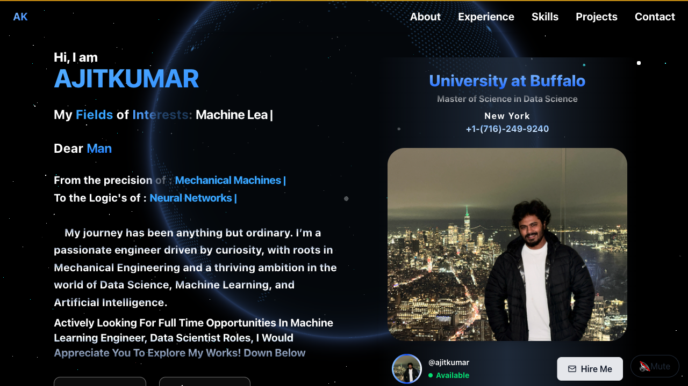
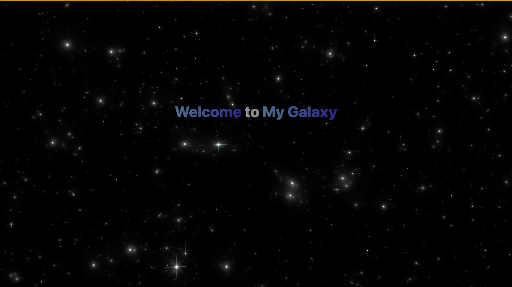

<div align="center">

# 🌌 Galaxy Portfolio

**A space-themed personal portfolio, built with Astro islands and WebGL.**

[](https://ajitkumar.io)
[](https://astro.build)
[](https://react.dev)
[](https://tailwindcss.com)
[](https://vercel.com)
[](LICENSE)

<br />



<sub>Content renders as static HTML at build time. Only the parts that move ship JavaScript.</sub>

</div>

---

## ✨ What's inside

| | |
|---|---|
| 🚀 **One-time welcome** | A shader-driven galaxy (ogl) greets first-time visitors, then steps aside. Returning visitors never see it, and neither do crawlers. |
| 🌍 **Living background** | 1,200 particles that react to the cursor, and a slowly rotating dotted globe (cobe) with location markers. |
| ⌨️ **Typing headline** | Cycling typed text for name, interests and audience, with a gsap-blinked cursor. |
| 🪐 **Orbiting skills** | Languages, ML/AI libraries and tools orbit in pure CSS rings, with hover tooltips. Separate desktop and mobile layouts. |
| 🗂️ **Projects** | Tilt-on-hover spotlight cards. "Read More" opens the matching post from [blog.ajitkumar.io](https://blog.ajitkumar.io) in a dialog. |
| 🕒 **Experience timeline** | A glowing vertical axis with alternating cards that slide in as you scroll. |
| 🎵 **Background music** | Autoplays where the browser allows it, otherwise unlocks on first interaction. One-tap mute. |

<div align="center">

</div>

## 🛠️ Stack

| Layer | Choice |
|---|---|
| Framework | [Astro 7](https://astro.build), static output, no adapter |
| Interactivity | [React 19](https://react.dev) islands via `@astrojs/react` |
| Styling | [Tailwind CSS v4](https://tailwindcss.com) (CSS-first, no config file) |
| Motion | framer-motion in the islands, CSS transitions + one IntersectionObserver for static sections |
| WebGL | [ogl](https://github.com/oframe/ogl) for particles and the splash shader, [cobe](https://cobe.vercel.app) for the globe |
| UI bits | shadcn/magicui-generated `dialog`, `button`, `orbiting-circles`; Radix + Lucide + react-icons |
| Hosting | Vercel |

## 🧭 How it's put together

The page is composed in `src/pages/index.astro`. Seven React islands hydrate: **Splash**, **Navbar**, **Particles**, **Globe**, **Audio**, **Hero** and **Projects**. Everything else (**About**, **Experience**, **Skills**, **Contact**, **Footer**) stays `.tsx` but renders with no client directive, so Astro emits plain HTML for it at build time and sends no JavaScript.

```
src/
├── pages/index.astro        composition root (the only route)
├── layouts/Layout.astro     <head>, GTM, global CSS, splash gate + reveal observer scripts
├── sections/                Hero · About · Experience · Skills · Project · Contact
├── comp/                    hand-written islands and pieces (Splash, particles, Galaxy, Texttype, ...)
├── components/ui/           shadcn/magicui-generated (dialog, button, globe, orbiting-circles)
├── data/data.ts             experience entries
└── styles/global.css        Tailwind import, theme tokens, splash + reveal rules
```

Two small conventions worth knowing:

- **Splash gate.** A blocking script in `<head>` adds `html.splash` on a first visit, so the overlay is visible before first paint and scroll is locked. When the animation ends it sets `sessionStorage.hasVisited`, removes the class and fires a `splash:done` event that Hero waits for.
- **Scroll reveal.** Give any static element `class="reveal"` (plus `reveal-left`, `reveal-right`, `reveal-pop` or `reveal-line`) and an optional `transitionDelay`. One observer adds `.in` when it scrolls into view. The rules are gated on `html.js`, so readers without JavaScript see everything.

`CLAUDE.md` has the fuller architecture notes; `PLAN.md` records the Vite-to-Astro migration and the decisions behind it.

## 🚀 Run it locally

Requires **Node 22.12+**.

```bash
npm install
npm run dev        # http://localhost:4321
npm run build      # astro check && astro build  → dist/
npm run preview    # serve dist/ (npx astro preview stop to stop)
npm run lint       # eslint
```

Want to see the splash again? Clear session storage for the site and reload.

## ✏️ Editing content

| What | Where |
|---|---|
| Projects | the `projects` array in `src/sections/Project.tsx` |
| Experience | `experience_content` in `src/data/data.ts` |
| Skills and their icons | `skillCategories` in `src/sections/Skills.tsx` |
| Hero copy and profile card | `src/sections/Hero.tsx` |
| Globe markers | `globeConfig` in `src/pages/index.astro` |
| Images, résumé, audio | `public/`, referenced as `/file.ext` |

## 📬 Say hello

[dev@ajitkumar.io](mailto:dev@ajitkumar.io) · [LinkedIn](https://www.linkedin.com/in/ajitkumar1001) · [GitHub](https://github.com/ajitkumar-1001) · [Blog](https://blog.ajitkumar.io)

## 📄 License

[MIT](LICENSE) © 2025 Ajit Kumar
